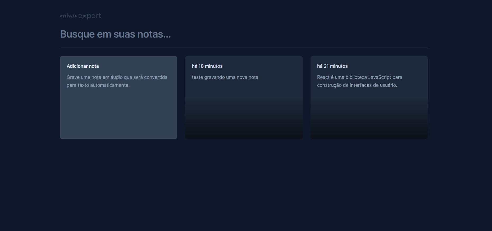

# Notes
Aplicação de notas desenvolvida durante o evento nlw expert da Rocketseat.
Consiste em salvar notas no local storage, permitindo seja possível gravar falando, foi implementada a função por meio da SpeechRecognition uma api disponível nos navegadores mais modernos.
  

## Deploy no Netify
<https://nlw-expert-notes-liviaaraujo.netlify.app/>
 

## Tecnologias

Esse projeto foi desenvolvido com as seguintes tecnologias:

- React JS
- TypeScript
- Tailwind CSS
- Vite  

## Instalar dependências

~~~bash
$ npm install
~~~

## Rodar Localmente

~~~bash
$ npm run dev
~~~

